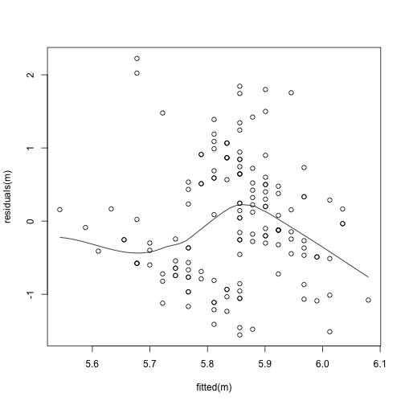
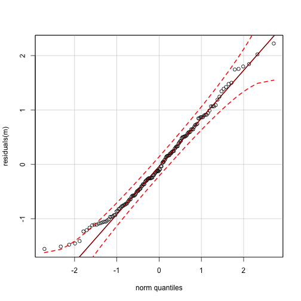

Mixed models
========================================================
author: I Bartomeus 
date: Nov 2016
autosize: true

Models
========================================================

I’ll designate:
Response variable –this is what we want to model as y.  
Predictors –This is what we think is affecting the response variable as x, z when continuos, and A, B when discrete with levels denoted by A1, A2, etc…   

Models abbreviated as m.  

Let’s start assuming normal error distributions:  

Model assumptions:
====================
The observed y are independent, conditional on some predictors x  
>Good experimental dessign! 

=====================

The response y are normally distributed conditional on some predictors x   
>qq plots of residuals (or large sample sizes)  

=====================
The response y has constant variance, conditional on some predictors x
>fitted vs residuals plot

=======================
There is a straight line relationship between y and the predictors x and random effects z
>look for nn-linearities visually  

========================
Random effects z are independent of y and Random effects z are normally distributed
>Good experimental dessign

Easy linear model with one predictor:
========================================

  `m <- lm(y ~ x)`
  
then check residuals. You want to see no pattern here:
    
  `scatter.smooth(residuals(m)~fitted(m))`



==========================

and a straight line here 


```r
library(car)
qqPlot(residuals(m))
qqline(residuals(m))
```



  
more diagnostics here: http://www.statmethods.net/stats/rdiagnostics.html
  
2) Let’s say you have also a Covariate z
=========================================

`m <- lm(y ~ z + x)`

`summary(m)`  
`coef(m)`  
`confint(m)`  

If you want the anova table  
`anova(m)`

Until now we wanted to see if there were differences among levels of A.
=========================================================================

A included as fixed factor -> “the expectation of the distribution of effects”

`lm(x ~ A + z)`

But if we want to see if there are general trends regardless of A, but we want to control for the variability due to A. –> “average effect in the population”, we use:

==========================

  a) random intercept model (we expect the trend to be equal, but some plants will differ on the intercept)
`library(nlme)`

`lme(y ~ x, random = ~1 | A)`

b) random slope model (we expect the trend to be dependent on species identity)
`lme(y ~ x, random = ~1 + x | A)`

In addition, now we can extract the random effects

`m$coefficients`

fixed and random factors, so we can see the random intercepts (and slopes) as well as

`intervals(m)`

To compare models in nlme
============================

To compare models with different fix effects structure using `anova` or `AIC` use `method="ML"`, but give final p-values with `method="REML"`.

But what if residuals are bad?
=================================

Don’t panic yet. Some times is because variance is different across groups/values, you can investigate that by:
  
`boxplot(A, residuals(m, type = "norm"))`

`plot(A, residuals(m, type = "norm"))`

==================================

and fix it by incuding a variance factor in the models `weights=varIdent(form=~1|A)` (for factors) or `weights= varPower(form=~x)` for continous variables (you can also try `VarExp` or `varConstPower`)

And to check if it worked:
  
`plot(residuals(m, type = "normalized") ~ fitted(m))`

The ref is Cleasby IR, Nakagawa S. 2011. Neglected biological patterns in the residuals. Behavioral Ecology and Sociobiology, 65(12), 2361-2372.

Is also recomended to center `scale(x, scale = FALSE)` or scale `scale(x)` predictors.
======================================================================================

Reference: Schielzeth, H. (2010), Simple means to improve the interpretability of regression coefficients. Methods in Ecology and Evolution, 1: 103–113.

You should also worry about co-linearity
============================================
`library(car)`

`vif(m)`

Should be lower than 2.5, and you should be very concerned when is over 10

or for lme’s load this little function from here (https://github.com/aufrank/R-hacks/blob/master/mer-utils.R)

and you may want to get R2 for glm also…
=============================================

Based in Nakagawa, S., Schielzeth, H. (2013), A general and simple method for obtaining R2 from generalized linear mixed-effects models. Methods in Ecology and Evolution, 4: 133–142.

`library(MuMIn)`

`r.squaredGLMM(m)`

=============================

More details and plotting here: https://www.zoology.ubc.ca/~schluter/R/fit-model/
  
Extra
======

==========================================

But the covariable should be added first because order matters. The result will be the variance explained by x after accounting for the variance due to A (that’s call a Type 1 error)

Otherwise what you actually have is not a covariable, but two predictors:

  `m <- lm(y ~ z + x)`  
  `summary(m)` #same here

====================================
  `library(car)`
  
  `Anova(m, Type = "II")`
  
  If there is indeed no interaction, then type II is statistically more powerful than type III
  If the interaction is significant type III is more appropriate
  
  `m <- lm(y ~ z * x)`
  `summary(m)`
  
  `Anova(m, Type = "III")`
  
========================================
when your design is classic balanced ANOVA design, it doesn’t matter as all types gives you the same answer. More info here: http://mcfromnz.wordpress.com/2011/03/02/anova-type-iiiiii-ss-explained/
    


Understanding the output, tricky specially when covariate is a factor.
=================================================================================
`m <- lm(y ~ A * x)`  
`summary(m)`  


```r
m <- lm(iris$Sepal.Length ~ iris$Species * iris$Petal.Length )
summary(m)
```

```

Call:
lm(formula = iris$Sepal.Length ~ iris$Species * iris$Petal.Length)

Residuals:
     Min       1Q   Median       3Q      Max 
-0.73479 -0.22785 -0.03132  0.24375  0.93608 

Coefficients:
                                         Estimate Std. Error t value
(Intercept)                                4.2132     0.4074  10.341
iris$Speciesversicolor                    -1.8056     0.5984  -3.017
iris$Speciesvirginica                     -3.1535     0.6341  -4.973
iris$Petal.Length                          0.5423     0.2768   1.959
iris$Speciesversicolor:iris$Petal.Length   0.2860     0.2951   0.969
iris$Speciesvirginica:iris$Petal.Length    0.4534     0.2901   1.563
                                         Pr(>|t|)    
(Intercept)                               < 2e-16 ***
iris$Speciesversicolor                    0.00302 ** 
iris$Speciesvirginica                    1.85e-06 ***
iris$Petal.Length                         0.05200 .  
iris$Speciesversicolor:iris$Petal.Length  0.33405    
iris$Speciesvirginica:iris$Petal.Length   0.12029    
---
Signif. codes:  0 '***' 0.001 '**' 0.01 '*' 0.05 '.' 0.1 ' ' 1

Residual standard error: 0.3365 on 144 degrees of freedom
Multiple R-squared:  0.8405,	Adjusted R-squared:  0.8349 
F-statistic: 151.7 on 5 and 144 DF,  p-value: < 2.2e-16
```

`(Intercept)` Value is the intercept for A1 (v1)  
A2 value (v2) is the difference in the intercept between A1 and A2 (the intercept for A2 is calculated as v1-v2)  
x Value is the slope for x given A1 (v3)  
x:A2 Value (v4) is the difference in the slope for x between A1 and A2 (the slope of x for A2 is calculated as v3-v4)  

Select models (by AIC or compare two models anova I know confusing name)
===========================================================================

`AIC(m)`  
`library(MuMIn)`  
`AICc(m)` #for small sample size  

`anova(m1,m2)`

But see below with random factors


With complex models you can drege them to find the best ones
===============================================================

library(MuMIn)

`m_set = dredge(m_full)`

`(top_m = get.models(m_set, subset = delta<3))`

and compute averages the regular way without shrinkage:
  
`model.avg(top_m)$avg.model`

See also names and `str(model.avg(top_m))`

Or estimates with shrinkage (zero method) – this makes the most difference for the less important predictors since they will get averaged with a bunch of zeros, probably: `model.avg(top_m)$coef.shrinkage`


